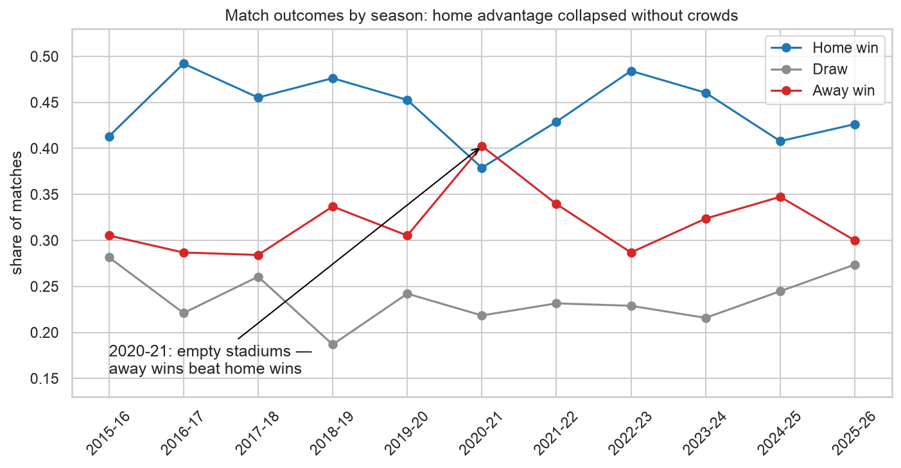
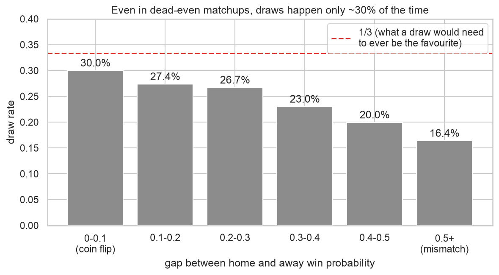
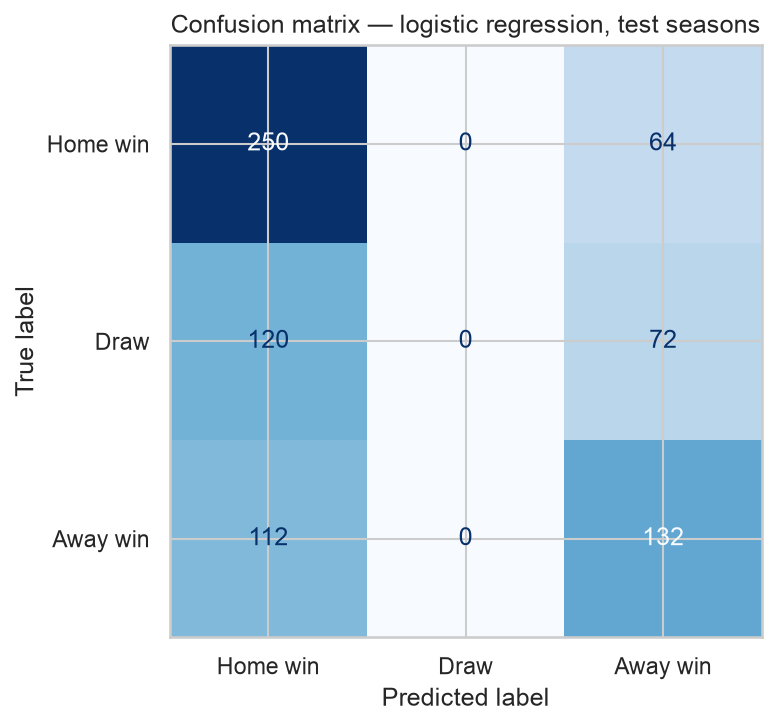
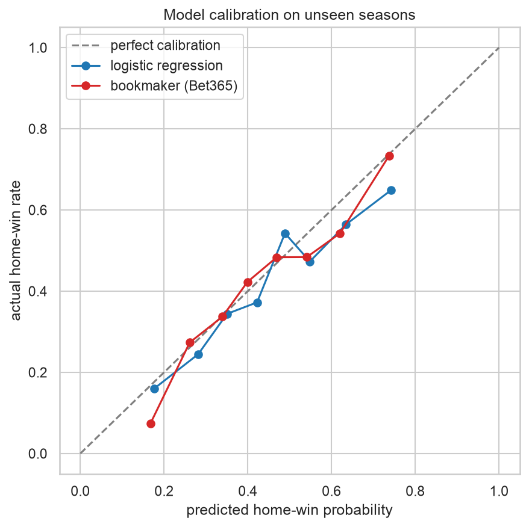

# EPL match prediction: benchmarking a simple model against the bookmakers

I predict Premier League match outcomes from 11 seasons of data and measure
the gap between a weekend model and Bet365. The project covers data
collection, cleaning, exploratory analysis, leakage-free feature engineering,
model selection, evaluation beyond accuracy, and an interactive
[Streamlit app](#try-the-app).

## TL;DR

I trained on 2015-16 through 2023-24 and tested once on two unseen seasons
(2024-25 and 2025-26; 750 matches):

| Contestant | Accuracy | Log loss |
|---|---|---|
| Naive baseline (class frequencies) | 41.9% | 1.082 |
| Logistic regression (this project) | 50.9% | 1.018 |
| Gradient boosting, tuned | 48.5% | 1.041 |
| Bookmaker (Bet365, margin removed) | 51.6% | 0.995 |

The model loses to the bookmakers, and the size of that loss is the finding.
Fourteen rolling form features and a linear model close most of the distance
between a class-frequency guess and an institution with money on the line.
The remaining 0.7 accuracy points rest on information outside this dataset:
injuries, lineups, motivation.

## The benchmark

Bookmaker odds make a strong benchmark because real money stands behind
their probability estimates. Every result in this README sits between a
naive floor and a professional ceiling.

**Data:** [football-data.co.uk](https://www.football-data.co.uk/englandm.php):
4,180 matches (11 seasons × 380) with results, match statistics, and Bet365
pre-match odds.

## Findings from the data (notebook 02)

Crowds account for part of home advantage. Home teams win 44% of matches
across the dataset, and in 2020-21, when matches ran without crowds, home
wins fell to 37.9% while away wins rose to 40.3%. That season is the single
one in the dataset where home teams fared worse than visitors, and it forms
a natural experiment inside the data:



The bookmakers' favourite wins 54.9% of matches, and their probabilities
track the outcomes they claim: a Bet365 60% shot lands near 60% of the time.
This reset my expectations before training: if the professionals top out
near 55%, a weekend project will miss 70%, and a model that claims 70% is
leaking data.

The draw finished as favourite in 0 of 4,180 matches. In dead-even matchups
draws occur at a rate near 30%, under the 1/3 threshold a draw needs to top
both win probabilities:



From this I knew, before any modeling, that a most-likely-outcome classifier
would pick zero draws, and that the pattern comes from the sport itself.

## Features without leakage (notebook 03)

At prediction time the model knows each team's history and nothing else.
Each side gets seven rolling features: recent form (points per game over the
last 5 matches), season-long strength (points per game over the last 38),
goals for and against, shots on target, venue-specific form, and rest days.
A `.shift(1)` before every rolling window restricts each match's features to
matches that finished before it, and the notebook verifies the restriction
with a hand-computed spot check.

Shots and corners from the match under prediction stay out of the feature
set, because those numbers exist after kickoff; the features consume them
through the historical windows. A model that reads them at prediction
time scores high in backtests and collapses on unplayed matches.

## Model selection: the simple model won

I compared candidates with time-series cross-validation inside the training
years, and the test seasons stayed outside every decision:

- Logistic regression: CV log loss 0.981
- Gradient boosting (tuned over a small grid): CV log loss 0.995

Cross-validation selected the linear model, and the test set confirmed the
choice. With 3,200 training matches and 14 features that summarize the
relevant history, a flexible model fits noise.

## Evaluation beyond accuracy

The confusion matrix matches the EDA finding: the model predicted 0 draws
in 750 matches.



The model's probabilities hold up under calibration. The curve runs close to
the diagonal, a short distance behind the bookmaker's, and confidence
carries signal: accuracy sits at 46% on toss-ups and rises to 69% on matches
where the model puts one outcome above 70%.



The ten largest misses are shock results (Arsenal losing at home to West Ham
at odds of 1.27, promoted Ipswich beating Chelsea) that the bookmakers
priced as heavy longshots as well.

The coefficients put season-long strength (`ppg_last38`) above recent
5-match form: the football saying "form is temporary, class is permanent"
shows up as a measurable coefficient gap.

## Surprises

1. Away wins beat home wins in the empty-stadium season. I expected home
   advantage to shrink without crowds, and it inverted.
2. The draw sat below the favourite threshold in all 4,180 matches, for my
   model and for the bookmakers alike.
3. The tuned gradient boosting model lost to plain logistic regression on
   both CV and test. I expected boosting to win by a small margin.
4. Fourteen transparent features land 0.7 accuracy points behind Bet365, a
   smaller gap than I assumed.

## Future work

- Player-level data (injuries, lineups, transfers), the likeliest source of
  the remaining bookmaker edge.
- Elo-style ratings to replace raw rolling points; they handle promoted
  teams and opponent strength with less distortion.
- A betting simulation: the model's probabilities disagree with the odds on
  some matches, and a value-betting backtest would put a profit-and-loss
  number on those disagreements after the 4.5% bookmaker margin. My
  calibration curve points to a loss.
- More leagues, to test whether the conclusions transfer.

## Try the app

```bash
git clone https://github.com/AbdullahBoraei/EPL-match-prediction.git
cd EPL-match-prediction
python -m venv .venv && source .venv/bin/activate   # Python 3.10+
pip install -r requirements.txt
streamlit run app/streamlit_app.py
```

Pick any two current Premier League teams and get win/draw/loss
probabilities with each team's current form, plus a plain-language section
on how far to trust the numbers.

## Repository guide

```
notebooks/01_data_and_cleaning.ipynb        download, clean, sanity-check 4,180 matches
notebooks/02_eda.ipynb                      home advantage, scoring, the bookmaker benchmark
notebooks/03_modeling_and_evaluation.ipynb  features, model selection, honest evaluation
src/                                        shared logic (data, features) used by notebooks AND app
app/streamlit_app.py                        interactive predictor
data/raw/                                   original season CSVs (never edited)
models/                                     trained model artifact
```

To reproduce from scratch, run the three notebooks in order; each one
re-downloads and re-builds its inputs.

## Part 2: Monte Carlo season simulation (C++)

The probabilities this model produces feed a second project:
[epl-monte-carlo](https://github.com/AbdullahBoraei/epl-monte-carlo), a
multithreaded C++ engine that simulates the full season millions of times
and turns per-match probabilities into season-level answers: P(title),
P(top 4), P(relegation), the expected final table with uncertainty, and
what-if analysis of single results.

`scripts/export_fixtures.py` bridges the two repos: it writes one season's
fixtures with model probabilities to `data/exports/`. Python owns the
modeling and C++ owns the simulation, at more than a million seasons per
second.

---

*Data: [football-data.co.uk](https://www.football-data.co.uk) (free
historical data). Educational project; this is not betting advice.*
